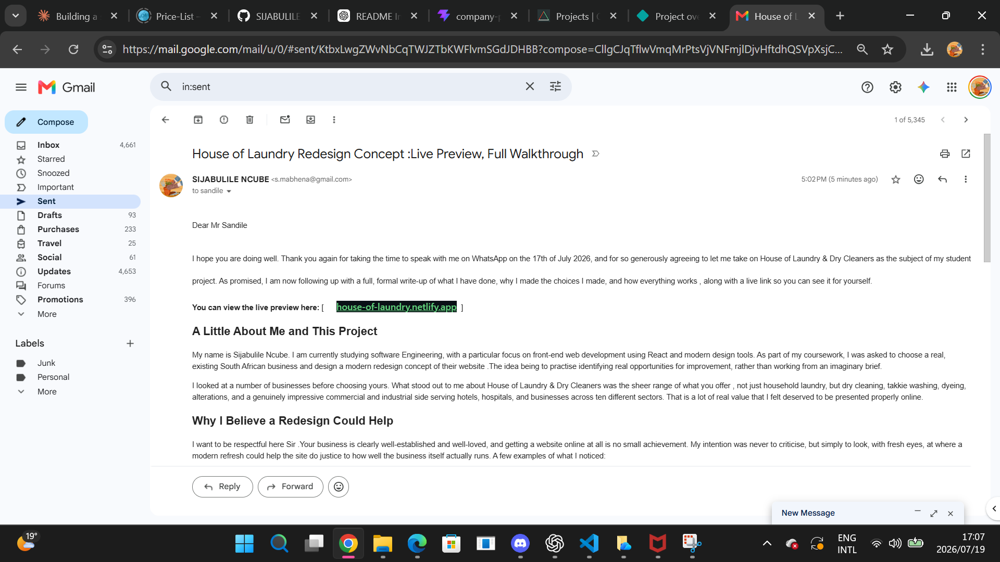
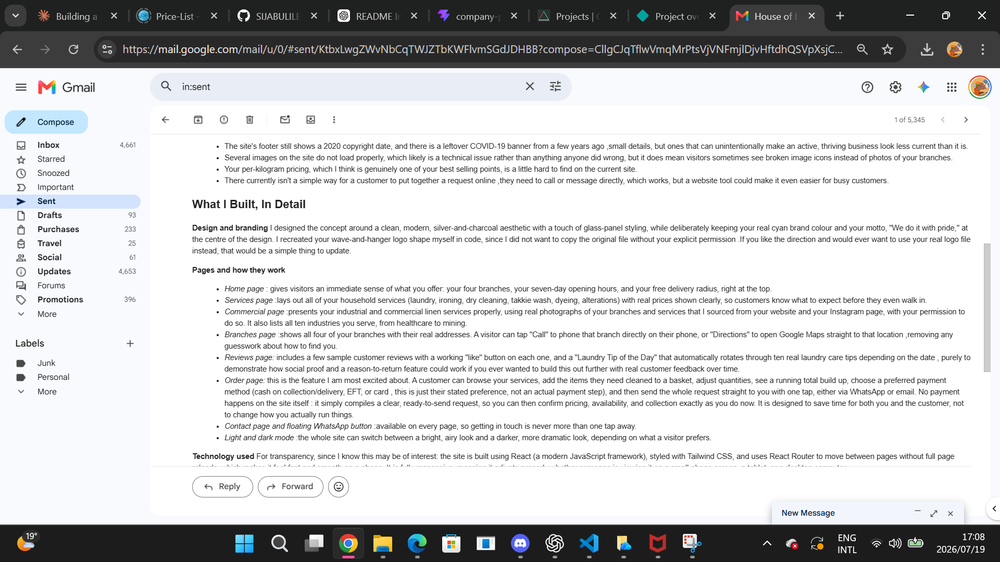
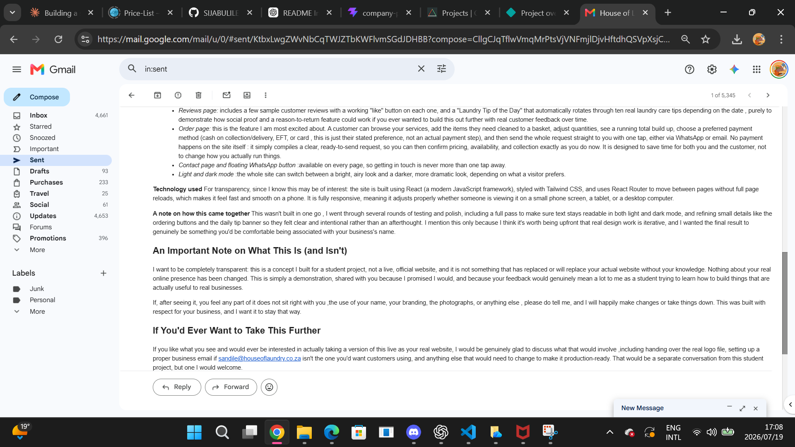
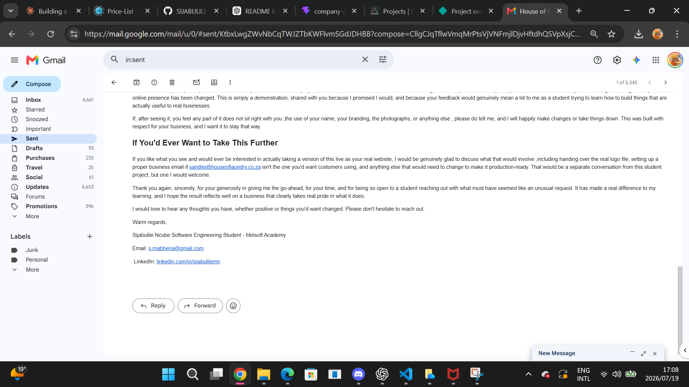

# Communication With the Business Owner

This file documents my outreach to and communication with the owner of House of Laundry & Dry Cleaners regarding this redesign project. The conversation took place over WhatsApp. Screenshots of the full exchange are saved in this folder as supporting evidence.

## Summary

Before building this project, I contacted the business owner directly via WhatsApp to:
1. Introduce myself as a Software Engineering student at Melsoft Academy
2. Explain the nature of the project (an academic redesign of an existing live website)
3. Reassure the owner that the project is purely educational and would not go live
4. Ask permission to recreate their website
5. Request their email address so I could send a formal follow-up with the completed link

The owner responded warmly, gave me the go-ahead to recreate the website for study purposes, and shared his email address (sandile@houseoflaundry.co.za) for the formal follow-up. With his permission granted, I sourced real photographs of the business from their website and public Instagram page to use in the redesign, rather than using generic stock imagery. He was gracious enough to also express interest in software engineering internship opportunities.

## Contact details

- **Business WhatsApp:** +27 78 026 3836
- **Owner's email (provided during the conversation):** sandile@houseoflaundry.co.za

---

## Transcript of the conversation

**Me:**
> Good day..
> My name is Sijabulile (Jabu). I was wondering if you have an email address if I need to send an email? 🙏

**Owner:**
> Hello I do have an email, what is this in connection with?

**Me:**
> Apologies Sir.
>
> My name is Sijabulile Ncube, I'm currently a Software Engineering student at Melsoft Academy, and we've been given a project to redesign an existing live website as part of our coursework.
>
> While looking for a laundry business website to work on, I came across House of Laundry and thought it would make a great choice for my project.
>
> Just to reassure you, this is purely an academic exercise and the redesigned website will not go live. The idea is simply to recreate your website using the skills I've learnt so far. Once I've completed the project, I'll send you a formal email with the redesigned version for [your reference].
>
> I hope you won't mind me using your website for this educational project. Thank you, and I really appreciate your time.
>
> For your reassurance, you're also welcome to look me up on LinkedIn, where you'll find my profile and professional background.
>
> Kindly find the following link: https://www.linkedin.com/in/sijabulilemn

**Owner:**
> No problem at all. Do you know someone who has completed their degree in software engineering? If so, please share the details — i might have an opportunity for the 12months internship

**Me:**
> Thank you very much for the opportunity and for [the] feedback... [I noted that LinkedIn is a good place to find candidates looking for internship opportunities. It might be worth posting the opportunity there, as it could help you connect with suitable candidates.]
>
> Thank you once again 🙏
>
> May you kindly share your email address as I will need to send a formal request for my task/project, and that's where I will also forward my link once the task is complete — this will be on Sunday (19/07/2026)

**Owner:**
> sandile@houseoflaundry.co.za

**Me:**
> Thank You so much 🙏

**Owner:**
> Pleasure

---

## Why this matters for the project

Reaching out to the real owner:
- Turned this from a hypothetical exercise into a real-world project
- Gave me clear permission to legitimately use the business's name, brand and content
- Let me legitimately source real photographs from their website and Instagram page to use in the design, rather than relying on generic stock imagery
- Established a professional relationship (the owner even raised a potential internship opportunity)
- Demonstrates professional initiative and real client communication — skills that matter as much as the code itself

## Screenshots

### WhatsApp conversation

### Formal follow-up email

Once the formal email (see `FORMAL-EMAIL.md`) was sent to the owner with the live link, screenshots of the sent email (from the Gmail Sent folder) were saved here as proof of delivery.

