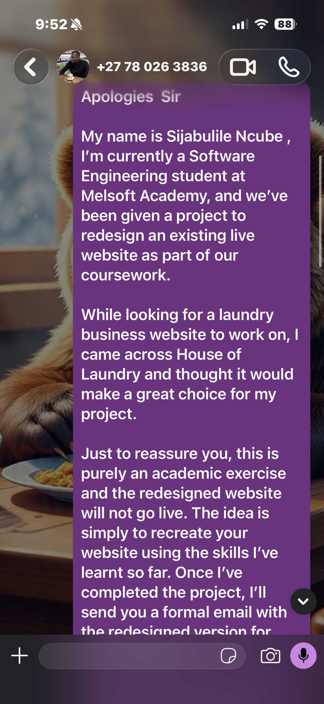
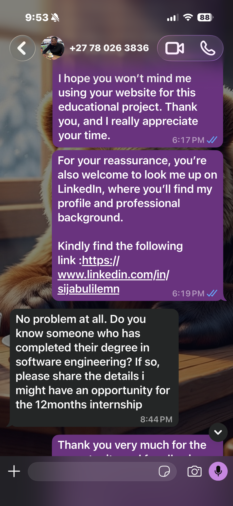
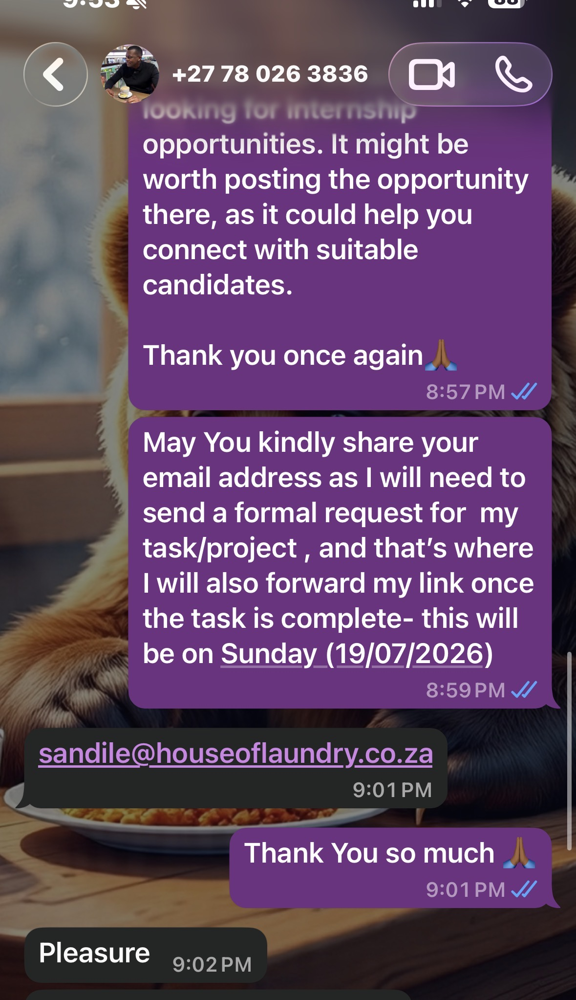

# WhatsApp Communication With the Business Owner

This file contains the real WhatsApp conversation between myself and the owner of House of Laundry & Dry Cleaners, in which I introduced myself, explained the project, and was given permission to recreate their website as a student project.

---

## Screenshot 1 — Introducing myself and asking for an email address

---

## Screenshot 2 — Explaining the project and asking permission

---

## Screenshot 3 — Owner's response and internship mention

---

## Screenshot 4 — Owner sharing his email address

---

## Contact details confirmed in this conversation

- **Business WhatsApp:** +27 78 026 3836
- **Owner's email (shared during this conversation):** sandile@houseoflaundry.co.za

## Why this conversation matters

This exchange is the real, primary evidence that:
- I contacted the actual business owner directly, not a fictional or assumed contact
- I was transparent from the start that this is a student project for academic purposes
- The owner explicitly gave permission for the website to be recreated as a redesign concept
- The owner voluntarily shared his email address for the formal follow-up

See `COMMUNICATION.md` for the full written summary and text transcript of this same conversation, and `FORMAL-EMAIL.md` for the formal email that was sent as a follow-up once the redesign was complete.
